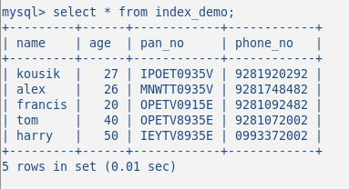

# Q1: Database Indexes là gì?

Index là một data structure, index được gán ở top của mỗi table. (Giống mục lục của một cuốn sách)
Index sẽ xem qua table (mà nó được gán), sẽ cố gắng phân tích và tóm tắt lại bản đó để nó tạo ra shortcuts địa chỉ data trong table.

# Q2: Điều gì khi database không định nghĩa index?

Khi thực hiện truy vấn một điều kiện, database sẽ tìm kiếm toàn bộ data trong table. Tuần tự tù đầu tới cuối. (được gọi là scan) - query will scan the whole table to find out the result:
Với data như bên dưới:

Thực hiện câu truy vấn: EXPLAIN SELECT \* FROM index_demo WHERE name = 'alex';

Ta có thể thấy, rows được scan là 5, Type : all (scan all row trong table)

# Q3: Cách nào để biết database đã được define index?

Sử dụng command "SHOW INDEX"
-> Kết quả trả về như bên dưới là không có:

# Q4: Điểm khác biệt giữa Key và index?

primary key is non null-able field which uniquely identifies each row.
Primary key không thể null, và là để phân biệt các row
Index là data tructrure đặc biệt, dùng để tìm kiếm bảng. index key có thể null.

# Q5: Vì sao tìm kiếm trên index lại nhanh? Khi nào nó nhanh và khi nào nó chậm?

ƯU điểm: tìm kiếm nhanh:
Clustered Index được sắp xếp với data cùng 1 không gian table hoặc cùng 1 đĩa.

Clustered Index là một B-tree (balanced tree):

các bước từ root tới node là đều bằng nhau, nên khi tìm kiếm mọi data đều có hiệu suất như nhau.
index đã được sắp xếp (tính chất của B-tree)
ƯU điểm: giúp tìm kiếm nhanh.

Nhược điểm:
Mỗi lần add / remove data ở database, thì index sẽ cập nhật lại các note là, và sắp xếp lại. quá trình này rất tốn tài nguyên (thời gian xử lý, ram xử lý).
Nên nó không nên dùng cho các table thường xuyên add, update, create, delete data

# Q6: có thể tạo index trên khoá phụ không?
Có, MySQL sẽ tạo tự động primary index.
Không nhất thiết phải tạo index trên primary key, ta có thể tạo trên any non primary.

