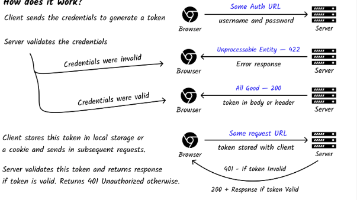
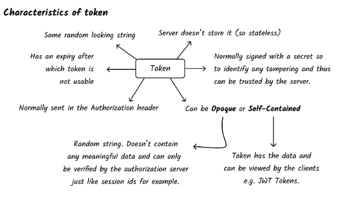

# Token

Token là một chuỗi string được genarated bởi server, để client gửi kèm trong mỗi request.

# Token base authentication

là sử dụng một token gửi đi từ client tới server trong mỗi request. server sẽ xác định danh tính client dựa vào token này.

# How does it work?

Client gửi thông tin danh tính đến sever để tạo token (có thể là username và password)

- Nếu danh tính (credentials) đúng, thì server sẽ cung cấp token ở respone (thông qua header hoặc body)
- Nếu danh tính (credentials) đúng, thì server trả về lỗi
  Mỗi request sau đó, Client sẽ gưỉ kèm token này trong header hoặc body.
- Nếu token đúng, sever sẽ trả về reponse theo yêu cầu
- Nếu token sai, server sẽ trả lỗi

Token thường được phía client lưu ở cookie hoặc local storage

# Đặc trưng của token

- Là chuỗi ngẫu nhiên
- Có thời gian hết hạn, và không tái sử dụng sau thời gian này
- Không được lưu ở server
- Thường được client gửi trong header
- Client thường được login và được tin tưởng bơi server

ref: https://roadmap.sh/guides/token-authentication
