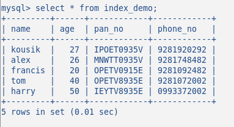

# Q1: Database Indexes là gì?

Index là một data structure, index được gán ở top của mỗi table. (Giống mục lục của một cuốn sách)
Index sẽ xem qua table (mà nó được gán), sẽ cố gắng phân tích và tóm tắt lại bản đó để nó tạo ra shortcuts địa chỉ data trong table.

# Q2: Điều gì khi database không định nghĩa index?

Khi thực hiện truy vấn một điều kiện, database sẽ tìm kiếm toàn bộ data trong table. Tuần tự tù đầu tới cuối. (được gọi là scan) - query will scan the whole table to find out the result:
Với data như bên dưới:

Thực hiện câu truy vấn: EXPLAIN SELECT \* FROM index_demo WHERE name = 'alex';

Ta có thể thấy, rows được scan là 5, Type : all (scan all row trong table)

# Q3: Cách nào để biết database đã được define index?

Sử dụng command "SHOW INDEX"
-> Kết quả trả về như bên dưới là không có:

